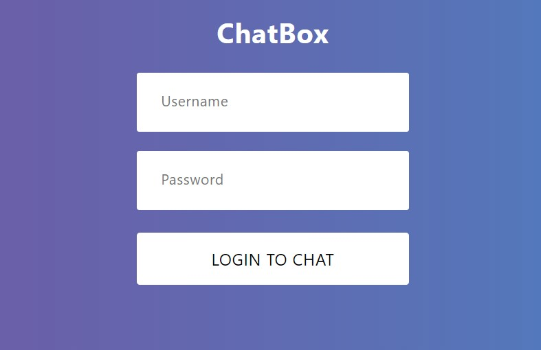
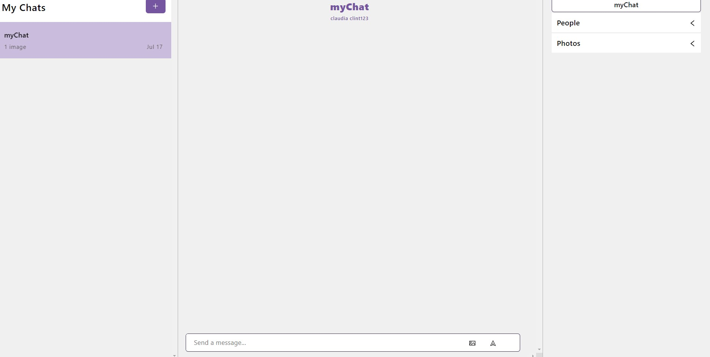

# Chat Box (Microsoft Teams Clone)
A complete frontend project where the user can create a chat area with his or her friends. I used this project to practice bringing in React hooks and using reasting API's. 
The user information is saved through local storage at the moment. However inside the chat the admininstrator for that particular chat box can create the conversations and organize the users to whichever chat area they would like.

## :bookmark_tabs: Table of Contents
* [Languages-used](#Languages-used)
* [Installation](#Installation)
* [Images](#Images)
* [Sources](#sources)
* [Future-Installations](#Future-Installations)

## Languages-used
1. React

## Installation
1. npx create-react-app ('app nam')
2. npm install axios
3. npm install @ant-design/icons
4. npm install react-chat-engine
5. create an account with chatengine.io [chatengine](https://chatengine.io/)
6. read through the documentation on chatengine.io and implement as many things as you would like to your page
 

## Images
 

## Sources
[chatengine](https://chatengine.io/docs)
[JavascriptMastery](https://www.youtube.com/c/JavaScriptMastery/videos)

## Future-Installations
1. Would like to incorporate mongo for user/password friendliness
2. Allow users to delete posts
3. Have it dynamic for all screens
